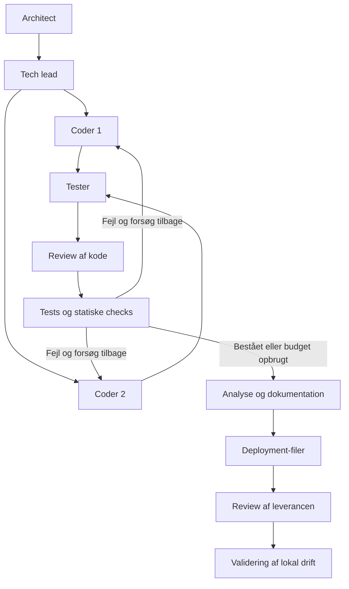

# Mahdi: LangGraph - koden styrer

Python-toolchainen bygger samme mødelokalebooking-API som Frederiks kandidat.
Den bruger vores fælles llama.cpp-backend og læser rolle-routing direkte fra
`../llm_backend/config/endpoints.yaml`. Den bruger ingen cloud-model.

**Status:** Den modtagne Windows-kørsel af `run-01` har bestået 21 tests, Ruff og mypy
med den rigtige Qwen-genererede kildekode og registrerede reviewrettelser. Efter rettelse
af Windows-oprydning bestod også import/health/SQLite-genstart; `run-01` er nu passed.
`run-02` er startet; den gentagne models.py-fejl håndteres nu af en særskilt registreret
kontraktrettelse. Fortsættelsen og resten af kørslens faktiske outputs mangler stadig
bekræftelse på Mahdis pc. Docker-image er ikke bygget.
Toolchainens egne tests bruger simuleret modeltransport og modtagne Qwen-artefakter;
pytest, Ruff, mypy, SQLite og git udføres rigtigt. Runtime: Python 3.12,
LangGraph 1.2.12 og langchain-openai 1.6.7. En anden sammenlignelig kørsel mangler stadig.

## Windows: IntelliJ og PowerShell

Forudsætninger, som installeres én gang: Python 3.12 med Python Launcher fra
[python.org](https://www.python.org/downloads/),
[Git for Windows](https://git-scm.com/downloads/win), og
[Docker Desktop](https://docs.docker.com/desktop/setup/install/windows-install/).
Kør de officielle installers, og start Docker Desktop med Linux-containere.
Hvis de allerede er installeret, fortsæt med versionskontrollen nedenfor.
På Linux bruges Docker Engine og Compose v2; på macOS Docker Desktop.

ZIP-filen indeholder kun `mahdi_toolchain/`. Kopiér den mappe ind i dit eksisterende
`LLM_mandatory_1`-projekt ved siden af `llm_backend/`, og erstat den korte gamle README.
Der skal ikke oprettes en `pom.xml`. IntelliJ er editoren; workflowet kører med Python
i terminalen. Python-plugin/interpreter er kun nødvendigt for IDE-funktioner og Run-knappen.

Start Docker Desktop. Åbn IntelliJs **Terminal** nederst og brug PowerShell.
Hvis terminalen står i projektets rod, kør:

```powershell
cd mahdi_toolchain
py -3.12 --version
git --version
docker compose version
py -3.12 -m venv .venv
.\.venv\Scripts\python.exe -m pip install -r requirements.txt
.\.venv\Scripts\python.exe run.py prepare-backend
```

Brug Python 3.12 til den reproducerbare demo. Hvis `py -3.12` ikke findes,
installér Python 3.12 fra [python.org](https://www.python.org/downloads/), og åbn terminalen igen.
`py -0p` viser installerede Python-versioner. Brug `.venv`-kommandoerne direkte;
det er ikke nødvendigt at ændre PowerShells execution policy eller aktivere miljøet.

`prepare-backend` opretter `.env` fra `.env.example`, genererer manglende nøgler
og bevarer eksisterende nøgler/indstillinger. Det retter CRLF til LF i backendens to
`.sh`-filer, så Docker kan læse dem på Linux. Nøglerne udskrives ikke. Det ændrer ingen
model-URL, port eller Docker-indstilling og bruger kun Python-standardbiblioteket.

Start jeres fælles backend:

```powershell
cd ..\llm_backend
docker compose up -d
docker compose logs -f model-init
```

Første gang downloades de to GGUF-modeller. Når downloaden er afsluttet, tryk
**Ctrl+C** for at afslutte logvisningen; containerne fortsætter.

```powershell
docker compose ps
cd ..\mahdi_toolchain
.\.venv\Scripts\python.exe run.py check
```

Begge endpoints skal være klar. `check` kontrollerer health, HTTP 401 uden nøgle,
model-alias og en rigtig chat-request med nøgle for hvert endpoint. Resultatet gemmes
i `diagnostics/endpoints.json`. Efter ændringer i `.env`, kør `docker compose up -d` igen.
Vent med `check`, indtil både `llm-a` og `llm-b` viser `healthy`. Færdig download og
`Started` er ikke det samme som en indlæst model. Ved `health: starting` kan du se
indlæsningen med `docker compose logs --tail 80 llm-a`. Et direkte tjek er
`curl.exe --max-time 10 -i http://127.0.0.1:8081/health`: 503 betyder indlæsning,
200 betyder klar. `model-init` skal afslutte med `Exited (0)`.

## Første rigtige modelkørsel

```powershell
.\.venv\Scripts\python.exe run.py run --id run-01
```

Architect og tech lead genererer plan/kontrakter på A. To workers genererer kildefiler
på B, og tester genererer tests på B. Koden anvendes og køres først efter review.
Programmet pauser med `Status: needs_review` og viser en sti til en `.diff`-fil.
Åbn diffen i IntelliJ, og gennemgå plan, kildefiler, tests og de angivne kommandoer.

Ved første pause ligger diffen i `runs/run-01/logs/code-round-0.diff`.
Godkend efter at have læst den:

```powershell
.\.venv\Scripts\python.exe run.py resume --id run-01 --decision approve
```

Nu anvendes koden i demo-repoet, og pytest, ruff og mypy køres. Ved fejl genereres
en rettelsesrunde, som også kræver review. Testerens tests ændres ikke under rettelsen.
Ved grøn kvalitet eller opbrugt rettelsesbudget genereres kvalitetsanalyse, dokumentation,
Dockerfile og deployment-tjekliste. Programmet pauser igen med `delivery.diff`.

Læs `runs/run-01/demo/reports/quality.md` og `runs/run-01/logs/delivery.diff`, og godkend:

```powershell
.\.venv\Scripts\python.exe run.py resume --id run-01 --decision approve
```

Til sidst kontrolleres import, health og persistent SQLite-lagring ved app-genstart.
Kun bestået kvalitet **og** bestået driftsvalidering giver `Status: passed`.
En fejlet kørsel giver `failed` og exitkode 2; den registreres som et evalueringsresultat.
En diff kan afvises med `--decision reject`; så afsluttes kørslen som `rejected`.

Hvis kvaliteten bestod, delivery allerede er godkendt, og kun den afsluttende
driftskontrol fejlede, kan samme kontrol gentages med:

```powershell
.\.venv\Scripts\python.exe run.py retry-deploy --id run-01
```

Kommandoen kontrollerer, at de godkendte artefakter og demoens tracked filer er uændrede.
Den bevarer fejllog/resultat som `logs/deployment-before-retry-001.txt` og `.json`,
registrerer gentagelsen i `logs/deployment-retry-001.json` og kører kun `validate_deploy`.
Ingen nye modelkald eller kvalitetstests udføres, og kildekode/tests ændres ikke.
Den nye status følger den faktisk udførte kontrol; den sættes ikke automatisk til passed.
`deployment_retries` tælles særskilt i summary/compare. En allerede bestået, ikke-godkendt
eller kvalitetsfejlet kørsel kan ikke bruge denne kommando.

```powershell
.\.venv\Scripts\python.exe run.py status --id run-01
```

Hvis Python blev afbrudt eller et modelkald fejlede uden review-pause:

```powershell
.\.venv\Scripts\python.exe run.py continue --id run-01
```

Ved den første kodepause kan en gennemgået rettelsespakke sættes ind i checkpointet:

```powershell
.\.venv\Scripts\python.exe run.py amend-review --id run-01 --patch .\diagnostics\reviewed-run-01.json
```

Ved delivery-pausen bruges den særskilte leverancepakke:

```powershell
.\.venv\Scripts\python.exe run.py amend-review --id run-01 --patch .\diagnostics\reviewed-run-01-delivery.json
```

Dette kontrollerer konfigurations- og indholdshashes for hele reviewet. Det bevarer
oprindelige modeloutputs/caches/attempt-logs, arkiverer den gamle diff og gemmer
rettelsernes før/efter-indhold, fase og ophav i nummererede `logs/review-edits-*.json`.
Den nye diff skal stadig læses og godkendes med `resume --decision approve`.
Kommandoen udfører ingen modelkald eller genereret Python-kode. Kodeændringer tillades
kun før første kvalitetstjek. Ved delivery må kun README, runbook, analyse, Dockerfile
og deployment-tjekliste ændres; kildekode, tests og målte kvalitetsresultater bevares.
Testene ændres fortsat ikke under automatiske kvalitetsrettelser.
Reviewrettelser tælles særskilt som `review_edits` i summary/compare og må ikke
beskrives som nye Qwen-outputs eller en ubearbejdet modelkørsel.

SQLite gemmer tilstand mellem graftrin. Godkendte modeloutputs caches efter prompt,
rolle, sti og endpoint-konfiguration, så et genstartet trin ikke skal generere dem igen.
Gemte kildefiler valideres igen. En ugyldig gammel cache gemmes i en særskilt
cache-invalidated.json før genopbygning; oprindelige attempt-logs ændres ikke.
Brug én terminalproces pr. kørsel. Fortsættelse kræver samme konfiguration; API-nøgler
kan opdateres, da de ikke gemmes i konfigurationssnapshot eller checkpoints.

Ved en fejl skal diagnosepakken omfatte alle JSON-filer i `runs/run-01/logs/` samt
`configuration.json`, `summary.json` og `mh_toolchain/llm.py`, `graph.py`, `parts.py`.
Funktionernes logs har navne som `coder_1-get_room-...`, ikke kun `coder_1-storage-...`.
De indeholder de rå svar, de konkrete prompts og samlingens kilder; API-nøgler logges ikke.

## IntelliJs Run-knap (valgfrit)

Hvis Python-understøttelse er installeret i IntelliJ, vælg interpreteren i
`mahdi_toolchain/.venv/Scripts/python.exe`. Opret en Python Run Configuration:

- Script: `mahdi_toolchain/run.py`.
- Working directory: `mahdi_toolchain`.
- Parameters: `check`, eller eksempelvis `run --id run-01`.

Du kan udføre hele opgaven i terminalen, selv hvis projektmodulet vises som Java.

## Linux / macOS / WSL

Fra `mahdi_toolchain/`:

```bash
python3.12 -m venv .venv
.venv/bin/python -m pip install -r requirements.txt
.venv/bin/python run.py prepare-backend
cd ../llm_backend
docker compose up -d
docker compose ps
cd ../mahdi_toolchain
.venv/bin/python run.py check
.venv/bin/python run.py run --id run-01
.venv/bin/python run.py resume --id run-01 --decision approve
```

Følg hver review-pause som på Windows. Ingen symlinks eller Bash-wrapper er nødvendig
for selve LangGraph-workflowet.

## Graf og rolle-routing



| Rolle | Standard-endpoint | Ansvar |
|---|---|---|
| architect | llm-a, 8081 | Komponenter, OpenAPI, topologi, ADR |
| tech_lead | llm-a, 8081 | Tickets med scope, DoD og afhængigheder |
| coder_1 | llm-b, 8082 | `models.py`, `storage.py` |
| coder_2 | llm-b, 8082 | `api.py` |
| tester | llm-b, 8082 | Tests og analyse af målte resultater |
| docs | llm-b, 8082 | README, API-brug og runbook |
| deploy | llm-b, 8082 | Dockerfile og deployment-tjekliste |

`Send` starter to workers med hver sit state og disjunkte filansvar. De sammenflettes
via en dict-reducer; ingen worker skriver kildefiler direkte på disken. Med backendens
`--parallel 1` serialiserer en lås modelkaldene på samme endpoint. Grafarbejdet er
partitioneret mellem to workers, mens CPU-inferens på B foregår én request ad gangen.
Beskriv det sådan i evalueringen, ikke som to samtidige modelgenereringer.

For at flytte en rolle ændres kun linjen under `roles` i fælles `endpoints.yaml`.
Andre konfigurationsstier vælges med `ENDPOINTS_FILE`, `LLM_BACKEND_ENV` og `WORKFLOW_FILE`.
Modeller, porte, svarbudget og timeout læses fra endpointfilen.
`max_fix_rounds` og `format_retries` står i `config/workflow.yaml`.
Formatbudgettet gælder hvert modeloutput, også hver funktion i en opdelt kildefil.
Hvis en samlet fil fortsat er for lang, bruges samme antal format-retries som loft for
målrettede samlingsrettelser: modellen får én eksisterende funktion og det nødvendige
linjemål. Kun den funktion genereres igen. Hver ny samlet fil skal bestå de normale kontroller.

## Kontekst og fejltilstande

- Hver opgave får SPEC, den faste interfacekontrakt og en eksplicit liste af relevante filer.
- Kildeopgaver afsluttes med en instruktion for præcis den fil, der skal genereres.
  `models.py` får et tydeligt markeret kontraktuddrag med de fire modeller; hele kontrakten
  er bevaret i demoen. Storage og API implementeres som separate funktioner.
- Testerens to moduler genereres med fire små testfunktionskald hver. Hvert kald får ét
  scenarie og en præcis header sidst i prompten. Toolchainen leverer imports, en pytest-
  klientfixture med ny in-memory-database pr. test og JSON-payloadhelpers; testkroppe og
  assertions kommer fra modellen. Den eksisterende app importeres, og klasser/fabrik må
  ikke redefineres i tests. En funktion skal indeholde HTTP-kald og reelle assertions.
  Testscaffolding er menneskeskrevet input; det er ikke påstået at være modelgenereret.
  Færdige testfunktioner caches separat med hashes i assembly.json. Gamle afviste
  helfilsforsøg bevares, og fortsættelse ændrer ikke workflow-snapshot eller modelvalg.
- Python-output kontrolleres uden eksekvering for manglende navne, tomme funktionskroppe,
  sammenblandede moduler og forkert Pydantic-validatorform. Fejlfeedback nævner konkrete
  navne og krav. Ved fortsættelse med samme prompt medtages seneste afvisningsårsag.
  Ruff kontrollerer desuden ukendte navne uden at importere eller eksekvere kildefilen.
  Testoutput kontrolleres også for ubrugte variabler, forkerte POST-stier og numerisk
  HTTP-status læst fra JSON i stedet for `response.status_code`.
  API-fabrikken skal have sin egen lokale FastAPI-instans og alle seks operationer.
  Storage afviser SQLite-cursors brugt som context managers og kræver sortering af
  bookinglisten efter start. En ugyldig funktionscache medfører kun nye kald for den funktion.
- Hvis `list_bookings` gentager R5-fejlen, får næste forsøg den konkrete afviste funktion,
  den præcise SQL-streng med `ORDER BY start` og besked om at undgå en ubrugt `room`-variabel.
  Samme rettelse bruges ved genoptagelse. Modellen leverer fortsat funktionen; kontrollen,
  retry-budgettet og de oprindelige attempt-logs bevares.
- En timeout eller API-/forbindelsesfejl sletter ikke feedback fra det seneste afviste
  modelsvar. Fortsættelsen finder det gennem efterfølgende fejllogs. Nye modelkaldsfejl
  gemmer `error_message` med SDK-/transportårsag og `http_status`, hvis den er tilgængelig.
  Konfigurerede nøgler og Bearer-værdier fjernes fra fejltekst, også i terminalen.
  Der foretages ingen automatisk gentagelse af et modelkald efter en transportfejl.
- Med den faste bookingkontrakt genereres Storage som syv funktioner og API som otte
  funktioner, herunder to exception handlers. Promptens små linjetal er mål for kompakt kode;
  de er ikke afvisningsgrænser. Kun den samlede kildefil skal have færre end 80 linjer.
  Hvert svar kontrolleres og caches selvstændigt. Fortsættelse genbruger færdige funktioner.
  Toolchainen leverer imports, exceptionklasser, signaturer, API-fabrik og route-dekoratorer;
  funktionsindholdet kommer fra modellen. Der indsættes ingen fixture-implementeringer.
  assembly.json dokumenterer den fulde oprindelige inputkontekst, hver funktionscache
  og dens hash. Rå modelsvar er bevaret i attempt-logs. Kun den samlede fil anvendes efter review.
  Hvis samlingen afvises, gemmes hele udkastet og kilderne i assembly-rejected.json.
  Hvis årsagen er linjetallet, kan en begrænset modelrettelse forkorte den længste funktion.
  Den får eget prompt/cache-fingerprint; kilder og modelkald dokumenteres som normalt.
- De to Send-resultater kontrolleres samlet i tester-trinnet, også når en gammel vellykket
  worker allerede er gemt i checkpointet. En ugyldig kildefil genopbygges før kode-review;
  arkitektur og tickets genereres ikke igen. Tests forbliver faste under kvalitetsrettelser.
- Hvis modelfilen har netop de tre klasser RoomCreate, Room og BookingCreate, og dens eneste
  strukturelle fejl er en manglende Booking, kan næste forsøg generere den klasse separat.
  Den modelgenererede klasse skal arve BookingCreate og tilføje id: int. Den samles med det
  bevarede modelsvar, og hele filen valideres igen. Det bruger det eksisterende retry-budget.
  Loggen indeholder det oprindelige afviste svar, klassesvaret, source_attempt og assembled_content;
  cachemetadata viser samlingen. Hvis modellen i stedet returnerer hele det korrigerede modul,
  valideres dette som en fuld fil med de samme krav til Booking; det afvises ikke for sin form.
- Den observerede `validate_start_end(cls, self)`-fejl kan kontraktrettes lokalt, når de
  tre modelklasser har præcis kontraktens fields og baser, decorator er after-validatoren,
  og cls ikke bruges i dens body. Signaturen bliver `validate_start_end(self) -> "BookingCreate"`.
  En manglende `Booking(BookingCreate)` med `id: int` tilføjes fra den faste kontrakt.
  Dette er en controllerrettelse, ikke et nyt modelsvar. Alle modelgenererede fields,
  imports og validatorens body bevares; en AST-kontrol tillader kun de to beskrevne ændringer.
  Hele filen skal derefter bestå normal statisk validering, Ruff og linjegrænsen.
  Andre fejl, forkert kontrakt, brug af cls og afbrudte/tokenafkortede svar repareres ikke.
  Et matchende gemt svar kan bruges uden nyt modelkald; nye svar håndteres på samme måde.
  Rå attempt-logs forbliver afviste og uændrede. Før/efter-kode, source-hash og ændringer
  står i `logs/*.contract-repair-*.json`, og cache henviser til denne audit. Summary og
  compare tæller rettelserne særskilt som `contract_repairs`. Review og kvalitet gælder stadig.
  Der bruges ingen testfixture-implementeringer. Almindelig retry-feedback er fallback
  for andre fejlsituationer. Fortsættelse bevarer færdige Send-workers og gamle logs.
- Ved fortsættelse kan tidligere komplette kildefilsvar og funktionssvar med samme
  request-fingerprint og finish_reason=stop valideres igen. Det gælder også funktioner,
  der tidligere blev afvist alene for promptens linjetal. De oprindelige attempt-logs bevares;
  en særskilt recovered.json og cache angiver kildeloggens hash og den tidligere afvisning.
  Det tæller ikke som et nyt modelkald og erstatter ikke plan/diff-review eller kvalitetstjek.
- Hvis en kildefil er for lang, kan det nødvendige antal tomme linjer fjernes. Separatorer
  foretrækkes; tomme linjer mellem metoder/nested handlers kan fjernes som sidste udvej.
  Multiline-strenge, kommentarer, statements og importgrupper bevares, og AST skal være identisk.
  Imports sorteres med Ruff. Ændringen dokumenteres i log/cache.
  Kode slettes ikke; hvis filen
  fortsat har 80 linjer eller mere, afvises den med faktisk linjetal og krav om kompaktere kode.
- Funktionslayout kan kompakteres med Ruff og tilstødende strengliterals. En SQL-streng kan
  dermed fylde færre kodelinjer, mens alle dens tegn, mellemrum og linjeskift bevares.
  Kun layout med identisk Python-AST accepteres; kommentarer og type-/kvalitetsdirektiver
  bevares. Rå output og normaliseret kode dokumenteres separat. Formatkontrollen
  eksekverer ikke funktionsindholdet. Plan/diff-review og pytest/Ruff/mypy gælder stadig.
  Linjeskift inde i parenteser kan også samles, når AST, strenge, kommentarer og grænsen
  på 100 tegn pr. færdig kodelinje bevares. Separate statements samles ikke.
  Normaliseres en gyldig gammel cache, gemmes dens tidligere indhold/hash i cache-revalidated.json,
  og cachen opdateres. Samlingens kodehash svarer dermed til den faktiske funktionscache.
- En gemt afvist samling kan genvalideres før nye modelkald. Kontekst, roller, syv/otte
  funktionskilder, cachehashes og funktionernes body-AST skal stemme. Hele filen skal bestå
  aktuelle checks og være under 80 linjer. assembly-recovered.json registrerer kilden og dens
  hash; de gamle attempt-logs og afvisningsfiler bevares. Review og kvalitetstjek gælder stadig.
  Ved en ny målrettet forkortelse accepteres modellen først, når hele samlingen også består.
- State bærer alle genererede artefakter mellem roller; manglende kontekst stopper trinnet.
- En fil eller en afgrænset funktion genereres pr. modelkald, så B's svarbudget på 1024 tokens kan holdes.
- API-funktioner får en særskilt kort systemprompt og en afsluttende opgave med deres præcise
  header og ene operation. FastAPI udfører inputvalidering; Storage og de fælles exception-
  handlers håndterer domænefejl. Modellen skal derfor delegere CRUD-kald uden ekstra validering,
  try/except eller imports. Et afvist svar medtages som read-only data ved næste forsøg.
  Gyldige funktionscaches og eksisterende request-fingerprints genbruges.
- llama.cpp's `/apply-template` og `/tokenize` bruges til budgetkontrol med en margen.
  Hvis de mangler, bruges en konservativ UTF-8-bytegrænse; store prompts afvises.
- Input afkortes aldrig uden besked. Lange fejllogs overdrages som et markeret uddrag;
  komplette rå logs er bevaret. En større opgave skal deles eller konteksten udvides.
- Forkert filformat, syntaks, manglende symboler eller `finish_reason=length` udløser ét nyt
  forsøg. OpenAPI-struktur, stier, schemas og statuskoder kontrolleres; semantikken skal reviewes.
- Efter sidste formatfejl stoppes trinnet. Brug `continue` efter at have løst årsagen.
- Testfejl giver højst én rettelsesrunde som standard; tests forbliver faste.
- Small-model-kvalitet og køretid er usikre, indtil rigtige modelkørsler er målt.

## Evidens og sammenligning

Hver kørsel ligger i `runs/<id>/` med:

- `demo/`: separat git-repo uden remote; kun faste Python-kommandoer håndterer git.
- `checkpoints.sqlite`: grafstate og review-pauser.
- `configuration.json`: model-/routing-/workflow-konfiguration uden API-nøgler.
- `endpoint-checks.json`: health, auth, alias og chat fra opstarten.
- `logs/`: prompts, modelsvar, tokens, tid, afvisninger, diffs og komplette check-outputs.
- `summary.md`, `summary.json`: status, fremdrift, kvalitet, roller, endpoints, commits og tid.
- `demo/reports/quality.md`: deterministisk rapport fra faktiske proces-exitkoder.
- `demo/reports/deployment.json`: import/health/persistens; Docker-build er `NOT_RUN`.

Kør igen med et nyt navn, følg review-pauserne og sammenlign derefter:

```powershell
.\.venv\Scripts\python.exe run.py run --id run-02
# Følg alle review-pauser for run-02, som for run-01.
.\.venv\Scripts\python.exe run.py compare --a run-01 --b run-02
```

Sammenligningen viser status, fejl/omforsøg, rolle- og endpointbrug, modeltid, testresultater,
filstruktur, identiske filer og commits. Samme struktur kræver ikke byte-identiske svar.
`model_seconds` summerer kaldetid; den er ikke vægurtid inkl. menneskelig review.

## Deployment, tests og videre arbejde

Workflowets lokale driftskontrol og genererede miljø-/konfigurationsdokumentation giver
et deployment-valideringstrin. Dockerfile er reviewbar, men image-buildet udføres ikke
automatisk. Når en rigtig demo har bestået, kan du følge dens deployment-tjekliste og
køre `docker build`/`docker run` manuelt for yderligere evidens.
API'et er en lokal undervisningsdemo uden autentificering. ISO-datoer med blandede
timezone-offsets og samtidige writes er ikke dækket af de faste tests.
Review før Python-eksekvering er kontrolmekanismen; demo-mappen er ikke en OS-sandbox.

Selvkontrol af toolchainen (simulerede modelsvar, ikke afleveringsdemo):

```powershell
.\.venv\Scripts\python.exe -m pytest -q
.\.venv\Scripts\python.exe -m ruff check mh_toolchain run.py tests
.\.venv\Scripts\python.exe -m mypy --ignore-missing-imports --no-incremental mh_toolchain
```

Se `REVIEW.md` for gennemgangen af originalfilerne og sporbarhed til opgavekravene.
Synopsen skal senere indeholde sammenligning af mindst to kandidater, en begrundet anbefaling
og review af en anden gruppes arbejde. Koden alene er ikke hele Mandatory 1-afleveringen.

## Open source og licenser

Projektets egen kode følger MIT-licensen i repoets `LICENSE`.

| Værktøj | Licens | Kilde |
|---|---|---|
| LangGraph + SQLite-checkpointer | MIT | https://github.com/langchain-ai/langgraph |
| langchain-openai | MIT | https://github.com/langchain-ai/langchain |
| llama.cpp | MIT | https://github.com/ggml-org/llama.cpp |
| FastAPI | MIT | https://github.com/fastapi/fastapi |
| Uvicorn | BSD-3-Clause | https://github.com/Kludex/uvicorn |
| PyYAML | MIT | https://github.com/yaml/pyyaml |
| pytest | MIT | https://github.com/pytest-dev/pytest |
| Ruff | MIT | https://github.com/astral-sh/ruff |
| mypy | MIT | https://github.com/python/mypy |
| python-dotenv | BSD-3-Clause | https://github.com/theskumar/python-dotenv |
| HTTPX | BSD-3-Clause | https://github.com/encode/httpx |
| Git | GPL-2.0 | https://github.com/git/git |
| Docker Engine / Compose | Apache-2.0 | https://github.com/moby/moby / https://github.com/docker/compose |
| Python | PSF | https://github.com/python/cpython |
| SQLite | Public domain | https://www.sqlite.org/copyright.html |

Afhængigheder er låst i `requirements.txt`; runtime-/dev-låse ligger i `template/`.
LangSmith-SDK'en er en transitiv afhængighed, men tracing er eksplicit slået fra, og der
bruges ingen hosted LangSmith-tjeneste. Docker Desktop og IntelliJ er værtsprogrammer;
selve workflowkoden er ikke afhængig af disse proprietære programmer.

Primære API-kilder: [Graph API](https://docs.langchain.com/oss/python/langgraph/graph-api),
[interrupts](https://docs.langchain.com/oss/python/langgraph/interrupts),
[SQLite-checkpointer](https://github.com/langchain-ai/langgraph/tree/main/libs/checkpoint-sqlite),
[ChatOpenAI](https://docs.langchain.com/oss/python/integrations/chat/openai),
[llama.cpp server](https://github.com/ggml-org/llama.cpp/tree/master/tools/server).
